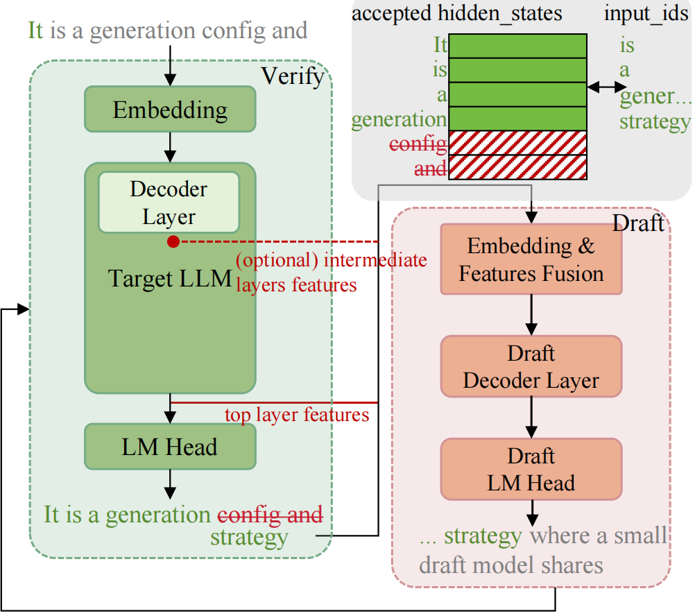
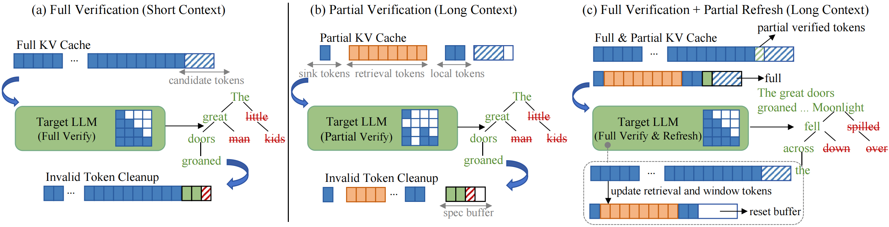

# SpecPV: Improving Self-Speculative Decoding for Long-Context Generation via Partial Verification

## Introduction
PyTorch implementation of SpecPV.
To further accelerate speculative decoding for long-context generation, we introduce SpecPV, a self-speculative decoding approach that performs fast verification using partial key–value (KV) states and periodically applies full verification to eliminate accumulated errors.

We build on a self-speculative decoding paradigm and adopt the [EAGLE3](https://github.com/SafeAILab/EAGLE) draft module. The overall framework is as follows:


For short context, we adopt classic full verification, whereas for long context, we use partial verification to improve efficiency. Periodic full verification eliminates accumulated errors and refreshes the partial KV cache. Taken together, these modes balance efficiency and accuracy across different context length.


## Get Started
### Installation
Create a new environment and install the required dependencies:

```bash
# 1. Create a Conda environment
conda create -n specpv python=3.11

# 2. Install PyTorch (CUDA 11.8)
pip install torch==2.7.1 torchvision==0.22.1 torchaudio==2.7.1 \
    --index-url https://download.pytorch.org/whl/cu118

# 3. Install SpecPV in editable mode
pip install -e .[dev]
```

### Models and Datasets
We first perform YARN fine-tuning on the EAGLE3 model. Our implementation is based on a modified version of [SpecForge](https://github.com/TanZhendong/SpecForge-Yarn), using 6,400 samples of the 32K PG-19 dataset for context extension (training dataset available here: [link](https://huggingface.co/datasets/hcyy/pg19-yarn-6400)).
The speedup evaluation is conducted on the PG-19-test set (also released here: [link](https://huggingface.co/datasets/hcyy/pg19-test)).

The shared checkpoints is available here: 

| Models               | Draft Models                |
| -------------------- | --------------------------- |
| [LLaMA3.1-8B-Instruct](https://huggingface.co/meta-llama/Llama-3.1-8B-Instruct) | [EAGLE3-LLaMA3.1-8B-YARN-64K](https://huggingface.co/TanBaby/EAGLE3-LLaMA3.1-Instruct-8B-YARN-64K) |
| [Qwen3-4B](https://huggingface.co/Qwen/Qwen3-4B)            | [EAGLE3-Qwen3-4B-YARN-64K](https://huggingface.co/TanBaby/EAGLE3-Qwen3-4B-YARN-64K)   |
| [Qwen3-8B](https://huggingface.co/Qwen/Qwen3-8B)            | [EAGLE3-Qwen3-8B-YARN-64K](https://huggingface.co/TanBaby/EAGLE3-Qwen3-8B-YARN-64K)   |
| [Qwen3-14B](https://huggingface.co/Qwen/Qwen3-14B)             | [EAGLE3-Qwen3-14B-YARN-64K](https://huggingface.co/TanBaby/EAGLE3-Qwen3-14B-YARN-64K)   |

### Usage
You can find runnable examples in the `tests/` folder.  
A minimal usage pattern consists of two parts: **model loading** and **generation**.

#### 1. Load the model

```python
from specpv import Speculator

model = Speculator.from_pretrained(
    base_model_path=base_model_path,
    ea_model_path=EAGLE_model_path,
    dtype=torch.bfloat16,
    low_cpu_mem_usage=True,
    device_map="auto",
    total_token=-1,
)
model.eval()
```

#### 2. Run SpecPV generation
```python
from specpv import SpecConfig

spec_config = SpecConfig(
    enable_offload=True,
    enable_partial_kv=True,
    n_retrieval_blocks=512,
    partial_spec_tokens=20,
)

output_ids, metrics = model.spec_generate(
    input_ids,
    temperature=0,
    max_new_tokens=256,
    max_length=35000,
    log=True,
    is_llama3=True,
    spec_config=spec_config,
)
```
SpecConfig contains the following parameters:
- `enable_offload`: Whether to enable offloading KV cache to CPU.
- `enable_partial_kv`: Whether to enable partial KV cache.
- `n_retrieval_blocks`: The number of retrieval blocks for partial KV cache.
- `partial_spec_tokens`: The number of tokens in buffer for partial KV cache.

### Evaluation
We provide evaluation scripts in the `scripts/` directory. After running them, you can process the generated outputs using the Python scripts in `evaluation/process_outputs`.


## Acknowledgements
This project is inspired by [**EAGLE3**](https://github.com/SafeAILab/EAGLE) and [**TriForce**](https://github.com/Infini-AI-Lab/TriForce), and we gratefully acknowledge their excellent work.

## Citation
TODO
